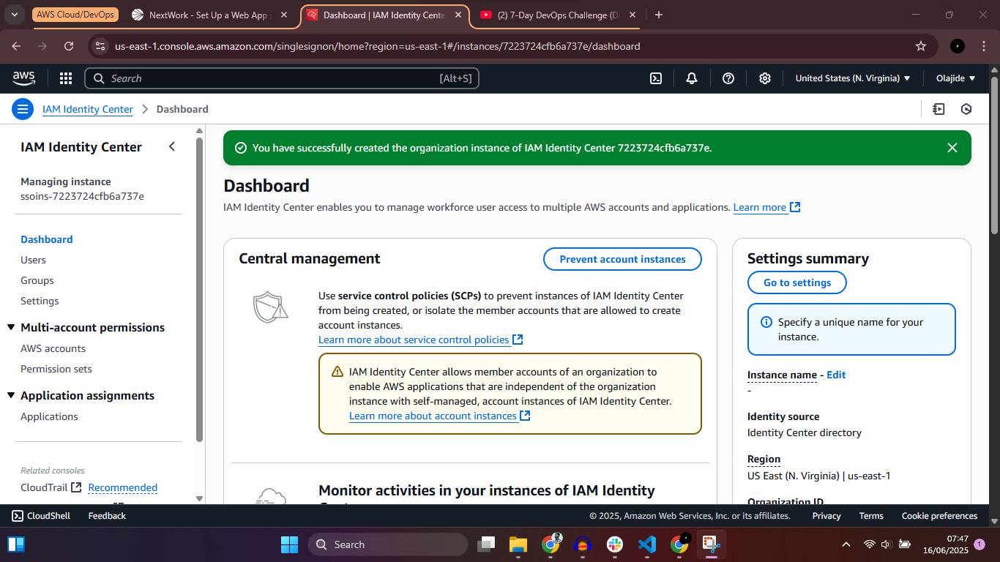
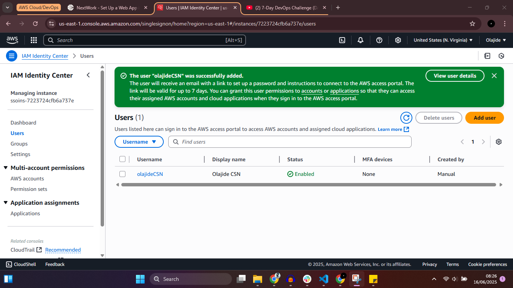
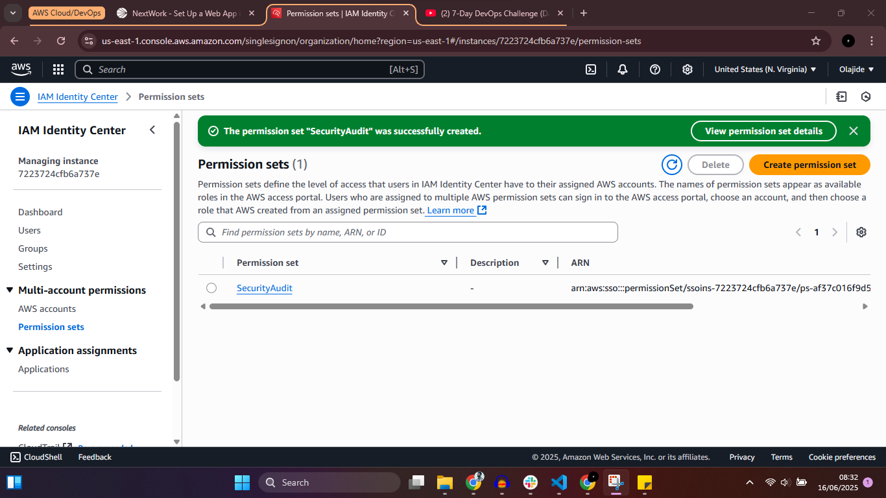
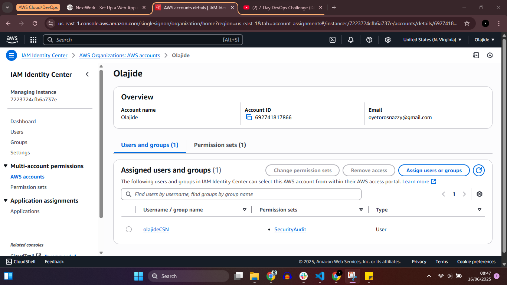

# AWS Identity Center Configuration Project

## 📌 Project Overview
This project demonstrates the configuration of **AWS Identity Center (formerly AWS SSO)**, including user creation and permission management using a predefined AWS job function policy.

The goal of this task was to implement centralized access control and apply the **SecurityAudit** permission set to a newly created user.

---

## 🛠️ Services Used
- AWS Identity Center
- AWS IAM
- AWS Managed Policies

---

## 📋 Task Summary
- Configured an AWS Identity Center instance
- Created a new Identity Center user
- Assigned a permission set using the predefined **SecurityAudit** job function policy
- Verified user access and permission assignment

---

## 🔐 Permission Set Details
- **Permission Set Name:** SecurityAudit  
- **Policy Type:** AWS Managed Job Function Policy  
- **Access Level:** Read-only access to security-related AWS resources  

---

## 📸 Screenshots

### 1️⃣ AWS Identity Center Instance

### 2️⃣ User Created

### 3️⃣ Permission Set Assigned
 (Week2/four.png)

### 4️⃣ Permission Assignment Confirmation

---

## 🎯 Key Learnings
- Understanding centralized identity and access management in AWS
- Applying AWS job function policies to enforce least privilege
- Managing users and permissions using AWS Identity Center

---

## 🚀 Use Case
This setup is suitable for:
- Security auditors
- Compliance teams
- Read-only access for monitoring and governance purposes

---

